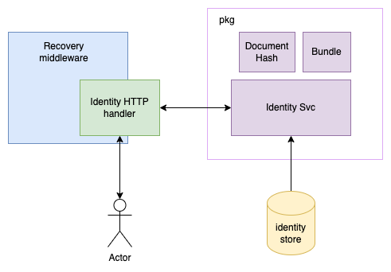

# go-identity

go-identity is a demo that demonstrates signing a document.
___

## Code structure

```text
.
├── README.md
├── domain
│   └── identity.go
├── go.mod
├── go.sum
├── handler
│   ├── error.go
│   ├── identity.go
│   └── identity_test.go
├── main.go
├── middleware
│   └── recovery.go
├── pkg
│   ├── bundle.go
│   ├── bundle_test.go
│   ├── document.go
│   ├── document_test.go
│   ├── identity.go
│   ├── identity_test.go
│   └── test.go
├── store
│   ├── identity.go
│   └── identity_test.go
└── utils
    └── util.go

6 directories, 19 files
```

Above is the overall structure of the repository. Its designed in layers to separate concerns (business logic, handlers, etc..) and also to faciliate testing.

 - domain: This holds domain specific entities. e.g `identity`
 - handler: Packages handlers and http specific structures including middlewares.
 - pkg: This is where the main business logic is kept.
 - store: The store is a data access layer to an underlying storage. For this demo, we used a simple `map`
 - utils: This packages useful utilities that are used across the codebase.

## Design
Below is the overall design of the components



### Recovery middleware
This is a middleware that catches all panics and returns a friendly message to the caller.

### Identity handler
The handler is a struct that implements the http handler interface.
We use a struct here so that we can pass custom properties to the handler.

```go
// Identity is the identity handler.
type Identity struct {
	log    *log.Logger
	router *mux.Router
	svc    *pkg.Identity
}
```

Constructor injection is used to set the dependencies so that we can replace them with custom/mock dependencies when unit testing.
```go
// NewIdentity returns a new identity handler.
func NewIdentity(log *log.Logger, router *mux.Router, svc *pkg.Identity) *Identity {
	return &Identity{
		log,
		router,
		svc,
	}
}
```
More:
- The handler accepts and returns `application/json`
- It also uses `POST` http method. We used `POST` intead of `GET` to bypass the hassle of url escaping/unescaping the base64 document hash that will be passed to it.

### Document Hash
This represents the hash of a document. 
- It's a 64 byte long SHA512 hash
- It provides methods to encode/decode from base64

### Bundle
This is represents packing of document and identity.
For this demo, all it does is combine them in a single stucture.

### Identity (domain)
This represents the identity of a user
```go
// Identity is a user identity.
type Identity struct {
	FirstName string    `json:"firstName"`
	LastName  string    `json:"lastName"`
	DOB       time.Time `json:"dob,string"`
}

```

### Identity (store)
This provides ability to retrieve identities from an underlying storage. In this case, it's a dummy `map[int]*domain.Identity` 
Constructor injection is used here as well to facilitate testing.
```go
// NewIdentity returns a new identity store.
func NewIdentity(d map[int]*domain.Identity) *Identity {
	return &Identity{d}
}
```

The identity store implements the `Store` interface so that it can be mocked.
```go
// Store is a store interface.
type Store interface {
	Get() *domain.Identity
}
```
For example,
```go
// MockIdentity is a identity store.
type MockIdentityStore struct {
	mock.Mock
}

// Get returns an identity from the store.
func (s *MockIdentityStore) Get() *domain.Identity {
	args := s.Called()
	return args.Get(0).(*domain.Identity)
}
```
### Identity (service)
This is the main part of the system. It's responsible for signing bundling document with identities, and then signing the bundle.
- A private key is required to be available in the os env. `PRIVATE_KEY`.
- It uses `ecdsa` algorithm to sign the `sha512` digest of the bundle.

It also uses constructor injection to decouple dependencies.
```go
// NewIdentity returns a new identity service.
func NewIdentity(s store.Store) *Identity {
	return &Identity{s}
}
```

## Main

The server runs on `PORT` and shuts down gracefully in a timeout of `SHUTDOWN_TIMEOUT`  
`main` is used to tie dependencies together and set up the system structure.

## Running the app

Make sure your envs are up-to-date

- `PORT`. Server port. Default is `8000`
- `SHUTDOWN_TIMEOUT`: Timeout to shut down server gracefully. Default is `5s`
- `PRIVATE_KEY`: Key to sign bundles. Default is `""`. It is required!

## Testing

Run tests with `go test ./...`  
If you want to run with coverage, do `go test -cover ./...`

```text
?       go-identity     [no test files]
?       go-identity/domain      [no test files]
ok      go-identity/handler     coverage: 79.5% of statements
?       go-identity/middleware  [no test files]
ok      go-identity/pkg         coverage: 85.2% of statements
ok      go-identity/store       coverage: 75.0% of statements
?       go-identity/utils       [no test files]
```
